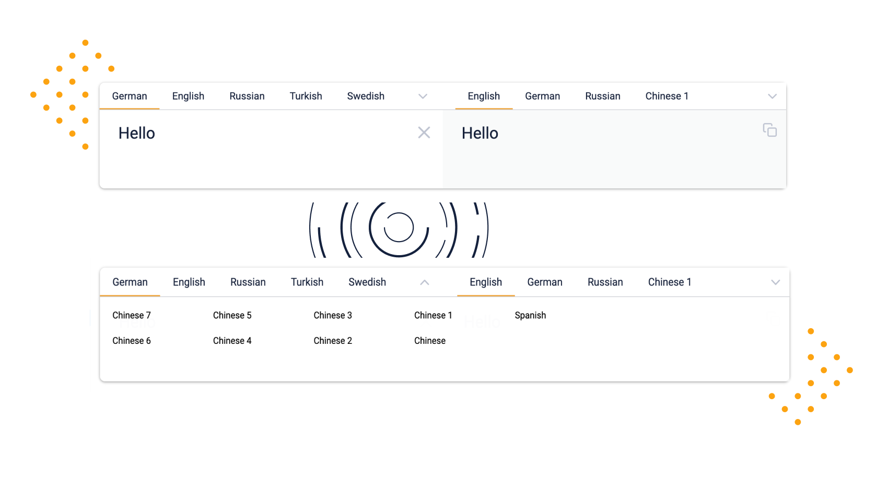

# react-in-out-textarea

  

> A simple React.js component that is like Google Translate



## Features

react-in-out-textarea is a highly customisable React component, for all of your input and output text needs. 

Some of the unique features this component offers include:

- Textarea fields for input and output
- Customisable input and output labels
- Selection of input and output types
- Dropdown to show all your labels when they won't fit on one line
- Fully controllable
- Ability to copy the output text to your clipboard
- Minimalistic, visually pleasing style 
- Variable content length (coming soon!)


## Used by

- [caseconverter.pro](https://caseconverter.pro/app)

## Installation

<details>
  <summary>Install via NPM</summary>
  
  ```bash
  npm install --save react-in-out-textarea
  ```
</details>

<details>
  <summary>Install via yarn</summary>
  
  ```bash
  yarn add react-in-out-textarea
  ```
</details>

## Usage

<details>
 <summary>React + TypeScript</summary>

[CodeSandbox Example](https://codesandbox.io/s/react-in-out-textarea-typescript-react-egi57?file=/src/ExampleComponent.tsx)

Code Example:

```tsx
import React, { useState } from 'react';
import { InOutTextarea, InOptions, OutOptions } from 'react-in-out-textarea';

export const ExampleComponent = () => {
  const [inValue, setInValue] = useState<string>('');
  const [outValue, setOutValue] = useState<string>('');
  const [inOptions, setInOptions] = useState<InOptions>([
    {
      name: 'English',
      active: true,
    },
    {
      name: 'German',
      active: false,
    },
  ]);
  const [outOptions, setOutOptions] = useState<OutOptions>([
    {
      name: 'Chinese',
      active: true,
      activeClicked: false,
    },
  ]);

  return (
    <InOutTextarea
      inValue={inValue}
      outValue={outValue}
      onInInput={(newValue) => {
        setInValue(newValue);
        setOutValue(newValue);
      }}
      inOptions={inOptions}
      onInOptionsUpdate={(newInOptions) => {
        setInOptions(newInOptions);
      }}
      outOptions={outOptions}
      onOutOptionsUpdate={(newOutOptions) => {
        setOutOptions(newOutOptions);
      }}
    />
  );
};
```

</details>

<details>
  <summary>React + Javascript</summary>
  
  [CodeSandbox Example](https://codesandbox.io/s/react-in-out-textarea-javascript-react-kcl37?file=/src/ExampleComponent.js)

  Code Example:

  ```js
  import React, { useState } from "react";
  import { InOutTextarea } from "react-in-out-textarea";

  export const ExampleComponent = () => {
    const [inValue, setInValue] = useState("");
    const [outValue, setOutValue] = useState("");
    const [inOptions, setInOptions] = useState([
      {
        name: "English",
        active: true
      },
      {
        name: "German",
        active: false
      }
    ]);
    const [outOptions, setOutOptions] = useState([
      {
        name: "Chinese",
        active: true,
        activeClicked: false
      }
    ]);

    return (
      <InOutTextarea
        inValue={inValue}
        outValue={outValue}
        onInInput={(newValue) => {
          setInValue(newValue);
          setOutValue(newValue);
        }}
        inOptions={inOptions}
        onInOptionsUpdate={(newInOptions) => {
          setInOptions(newInOptions);
        }}
        outOptions={outOptions}
        onOutOptionsUpdate={(newOutOptions) => {
          setOutOptions(newOutOptions);
        }}
      />
    );
  };
  ```
</details>

## Development

To start developing you need the following tools installed:

- Node.js version 12 - [Download](https://nodejs.org/en/download/)
- yarn - [Download](https://classic.yarnpkg.com/en/docs/install/#mac-stable)

After installing all the tools, you can install all dependencies by using in your terminal

```bash
yarn
```

After that just type:

```bash
yarn storybook
```

And open http://localhost:6006/. That should give you the storybook preview.

## Storybook

> Storybook is an open source tool for developing UI components in isolation for React, Vue, Angular, and more. It makes building stunning UIs organized and efficient.

[Storybook](https://storybook.js.org/) is a tool used here for easy development of components for the web. Since this project uses React.js, the decision for storybook was kind of easy. It makes the development workflow seamless.

Our stories are saved under the [`./stories`](./stories) directory. Feel free to have a look.

## License

The code is licensed under [MIT](./LICENSE).

## Contributors ✨

Thanks goes to these wonderful people ([emoji key](https://allcontributors.org/docs/en/emoji-key)):

<!-- ALL-CONTRIBUTORS-LIST:START - Do not remove or modify this section -->
<!-- prettier-ignore-start -->
<!-- markdownlint-disable -->
<table>
  <tr>
    <td align="center"><a href="https://www.kevinpeters.net/about/"><br /><sub><b>Kevin Peters</b></sub></a><br /><a href="#business-igeligel" title="Business development">💼</a> <a href="https://github.com/igeligel/react-in-out-textarea/commits?author=igeligel" title="Code">💻</a> <a href="#design-igeligel" title="Design">🎨</a> <a href="#infra-igeligel" title="Infrastructure (Hosting, Build-Tools, etc)">🚇</a> <a href="#maintenance-igeligel" title="Maintenance">🚧</a> <a href="#question-igeligel" title="Answering Questions">💬</a> <a href="https://github.com/igeligel/react-in-out-textarea/pulls?q=is%3Apr+reviewed-by%3Aigeligel" title="Reviewed Pull Requests">👀</a></td>
    <td align="center"><a href="https://codepen.io/SheWolf/"><br /><sub><b>Amber</b></sub></a><br /><a href="https://github.com/igeligel/react-in-out-textarea/commits?author=SheW0lf" title="Code">💻</a></td>
    <td align="center"><a href="http://katieannabelle.dev"><br /><sub><b>Katie</b></sub></a><br /><a href="https://github.com/igeligel/react-in-out-textarea/commits?author=katieraby" title="Code">💻</a></td>
    <td align="center"><a href="https://github.com/hambali999"><br /><sub><b>chorongbali</b></sub></a><br /><a href="https://github.com/igeligel/react-in-out-textarea/commits?author=hambali999" title="Code">💻</a></td>
    <td align="center"><a href="http://devcer.github.io/"><br /><sub><b>Santosh Viswanatham</b></sub></a><br /><a href="https://github.com/igeligel/react-in-out-textarea/commits?author=devcer" title="Code">💻</a> <a href="#infra-devcer" title="Infrastructure (Hosting, Build-Tools, etc)">🚇</a></td>
    <td align="center"><a href="https://github.com/xen0m29"><br /><sub><b>xen0m29</b></sub></a><br /><a href="https://github.com/igeligel/react-in-out-textarea/commits?author=xen0m29" title="Code">💻</a></td>
    <td align="center"><a href="https://github.com/merelj"><br /><sub><b>merelj</b></sub></a><br /><a href="https://github.com/igeligel/react-in-out-textarea/commits?author=merelj" title="Code">💻</a></td>
  </tr>
</table>

<!-- markdownlint-enable -->
<!-- prettier-ignore-end -->
<!-- ALL-CONTRIBUTORS-LIST:END -->

This project follows the [all-contributors](https://github.com/all-contributors/all-contributors) specification. Contributions of any kind welcome!
